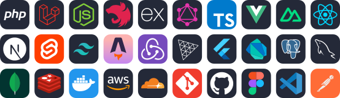

  
  <h1>Ahmed Eleaswy</h1>
  
<b>Senior Software Engineer · Full-Stack Engineer · Forward Deployed Engineer</b>

  

    
    
    
    
    
  

  <b>6+ years</b> · <b>9 featured products</b> · <b>4 teams</b> · <b>Arabic / English</b> · <b>GMT+2</b>

  
  <b>Code samples →</b> <a href="https://github.com/AhmedEaswy/my-code-identity">My Code Identity</a>
   
  Open first:
    <a href="https://github.com/AhmedEaswy/my-code-identity/tree/main/cases/01-invariant-enforcement">Money integrity</a> ·
    <a href="https://github.com/AhmedEaswy/my-code-identity/tree/main/cases/06-type-safe-api">Type-safe APIs</a> ·
    <a href="https://github.com/AhmedEaswy/my-code-identity/tree/main/cases/09-course-progression-certificates">Course progression</a>
  

I ship production systems end to end — from the database invariant to the last accessible pixel — and I like being *deployed* close to the problem: embedded with the people who have it, turning an ambiguous requirement into something running in production. My bias is toward **correctness under real-world pressure**: money that reconciles, contracts that cannot drift, and failures that are loud and specific instead of silent.

##  What "forward deployed" means to me

I don't wait for a perfect ticket. I get close to the user or the operator, find the real constraint, and build the smallest correct thing that removes it — then harden it.

-  owning multi-payment-gateway flows and an **advanced dashboard** end to end;
-  scaling a **charity donation and beneficiary system** over a long engagement;
-  shipping **fast, animated, SEO-strong** product and marketing sites;
-  keeping a large team's product **coherent across Nuxt, Next.js, Laravel and TypeScript**.

> The through-line in every stack: **model the invariant, make illegal states unrepresentable, prove it with a test, and make the failure mode loud.**

##  Experience

**Senior Full-Stack Developer — [From Scratch](https://fromscratch-solutions.com/)** · Remote (Turkey) · 2024 – Present
Working in a large team on advanced products with Vue.js, Next.js and Laravel.

**Full-Stack Developer — [Share Adawli IT Solutions](https://share.net.sa/)** · Saudi Arabia (Hybrid) · 2022 – 2024
Enhanced and scaled advanced charity systems, built a web-builder SaaS, and delivered many client-based projects.

**Front-End Developer — [5Code](https://www.5code.net/)** · Freelance (Remote) · 2022 – 2023
Delivered client projects within a large team.

**Front-End Developer — [Rwabett](https://rwabett.com/)** · Cairo · 2019 – 2023
Built web projects across the front end, growing into backend work.

##  Selected projects

| Project | What I built | Stack | Live |
|---|---|---|---|
| **Digi Pedia** | Digital encyclopedia, an online courses platform and live webinars; multiple payment gateways and an advanced dashboard | Laravel · Nuxt · Payments | [visit](https://digi-pedia.com/) |
| **2060 Agriculture** | Full e-commerce website and dashboard, built for performance and design quality | Nuxt 3 · TS · Tailwind · Vuetify | [visit](https://shop.2060ksa.net/) |
| **Maazim** | Complete gifting platform for Saudi Arabia plus a full management dashboard | Nuxt · Tailwind · SSR · REST | [visit](https://maazim.app/) |
| **Code Moments** | Software-house website and portfolio: pixel-perfect, animated, SEO-strong | Nuxt · TS · GSAP | [visit](https://codemoments.com/) |
| **Ablir.sa** | Charity donations store and beneficiary system — built, enhanced and scaled | Laravel · Livewire | [visit](https://albir.sa/) |
| **Taifk** | Two-sided services marketplace: bookings, a double-entry wallet ledger, payments and a data-heavy Nuxt admin | Laravel · Filament · Nuxt · Redis | [visit](https://taifk.com.sa/) |
| **Bosalty** | Tourism marketplace: subscription billing, payments, WhatsApp flows and a maps trip planner | Laravel · Filament · Livewire · Pest | [visit](https://bosalty.com/) |
| **Leap / Leap PM** | Cross-platform product: a typed Bun/oRPC/Drizzle backend powering React and native apps, with realtime chat | Bun · oRPC · Drizzle · React · Expo | [visit](https://leap-pm.com/) |
| **Ahmad Alzeer** | Bilingual personal-brand and knowledge platform with a Filament admin and zero-downtime Deployer CI/CD | Laravel · Filament · Livewire · Deployer | [visit](https://ahmadalzeer.com/) |

##  Tech I use

  

**Also:** Livewire · Filament · oRPC · Drizzle · Alpine.js · Vuetify · Nuxt UI · ECharts · GSAP · Capacitor.js · PWA · Better-T-Stack · Deployer

##  GitHub

  
  

##  Education

**B.Sc. Computer Science & Statistics — Mansoura University** · 2020 – 2025

##  Volunteering

**Front-End Mentor — CAT Reloaded (Mansoura University IEEE)** · 2021 – 2022
Mentored and trained students and senior students.

##  Let's connect

-  **Email:** elesawy325@gmail.com
-  **LinkedIn:** https://www.linkedin.com/in/ahmed-eleaswy
-  **GitHub:** https://github.com/AhmedEaswy
